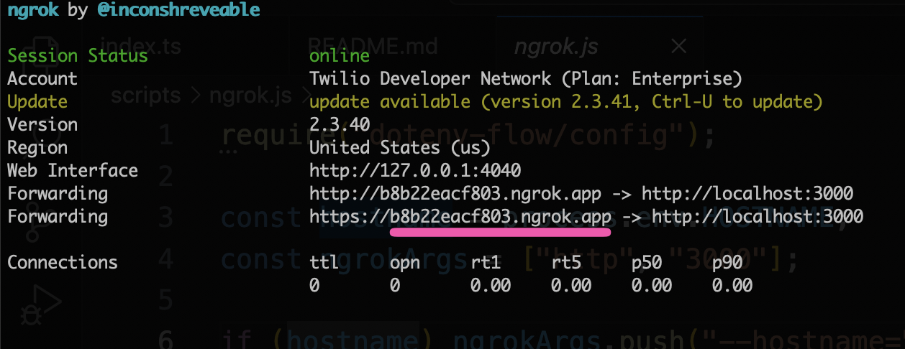

# Twilio Real Time Transcription Demo

This is the simplest possible implementation of Twilio [Real-Time Transcription](https://www.twilio.com/en-us/changelog/realtime-transcriptions-is-public-beta).

## Getting Started

### You will need...

- [Twilio account](https://www.twilio.com/try-twilio) with a [phone number](https://help.twilio.com/articles/223135247-How-to-Search-for-and-Buy-a-Twilio-Phone-Number-from-Console)

- [nGrok installed globally](https://ngrok.com/docs/getting-started/), if you want to run it locally

### 1. Setup Project

```bash
git clone https://github.com/pBread/twilio-real-time-transcription-gist.git
cd twilio-real-time-transcription-gist
npm install
```

### 2. Start nGrok Tunnel

#### Install nGrok Globally

You will need nGrok installed as a global package.

#### (A) With a private nGrok domain

You can use a private nGrok domain by adding the `.env` variable `HOSTNAME` then running `npm run grok`.

#### (B) Without a private nGrok domain

If you don't have a nGrok domain, you need to start your nGrok server first and then copy the hostname into `.env` **before** starting your server. The app needs to know what it's public domain.

```bash
ngrok http 3000
```



Copy the domain into `.env` as `HOSTNAME`

```
HOSTNAME=b8b22eacf803.ngrok.app
```

### 3. Configure Twilio Phone Number Webhooks

Login to the Twilio Console, navigate to Phone Numbers > Manage Numbers then configure a phone number – obviously, buy a phone number if you don't have one.

Set the "a call comes in" webhook to `https://your-domain.ngrok.app/incoming-call` and the "call status" webhook to `https://your-domain.ngrok.app/call-status-update`

### 4. Start App

```bash
npm run start
```

### 5. Call Phone Number

Call the Twilio Phone Number. Anything you say will be transcribed in realtime and logged to the console.
